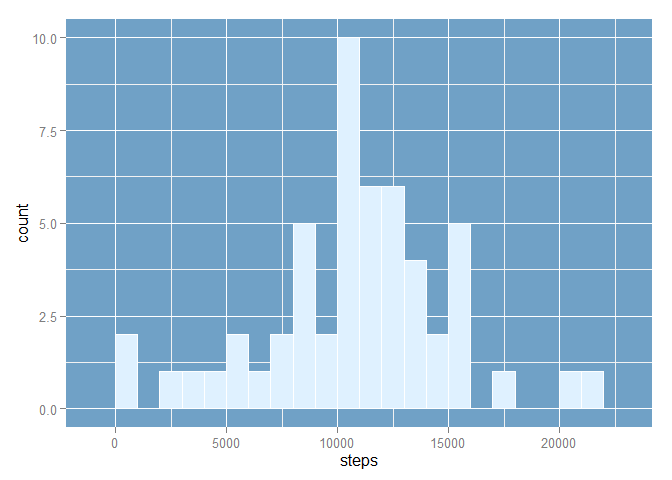
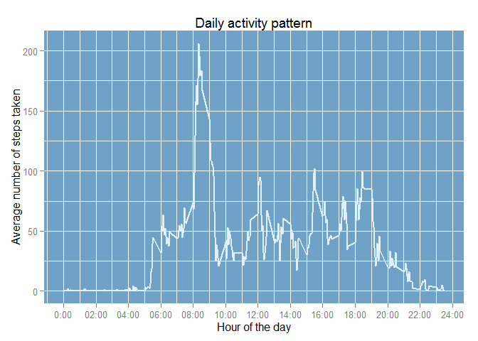
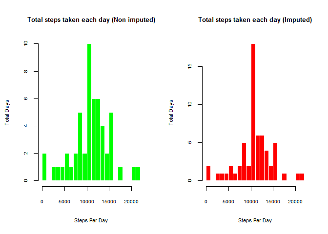
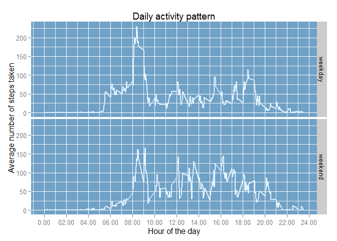

# Reproducible Research: Peer Assessment 1

This assignment makes use of data from a personal activity monitoring device. This device collects data at 5 minute intervals through out the day. The data consists of two months of data from an anonymous individual collected during the months of October and November, 2012 and include the number of steps taken in 5 minute intervals each day.

To show every piece of code, we have to set the `echo` global option as TRUE. I also like to set the warnings and messages as FALSE just to avoid the "missing warnings", "this packages was built for R version xx.xx" and so.


## Loading and preprocessing the data

Let's start, unziping the activity.zip file in the data directory. If there is no an activity.zip file, the code will download and unzip the file.


```r
# download file from server and unziping
ifelse(!file.exists("./data/activity.zip"),
       download.file(url = "https://d396qusza40orc.cloudfront.net/repdata%2Fdata%2Factivity.zip",
                     destfile = "./data/activity.zip",
                     method = "libcurl"),FALSE)
unzip("./data/activity.zip", exdir = "./data")
```

Now we have our data set, we have to load it in a data frame called "activity".


```r
activity <- read.csv("./data/activity.csv", header = TRUE)
str(activity)
```

```
## 'data.frame':	17568 obs. of  3 variables:
##  $ steps   : int  NA NA NA NA NA NA NA NA NA NA ...
##  $ date    : Factor w/ 61 levels "2012-10-01","2012-10-02",..: 1 1 1 1 1 1 1 1 1 1 ...
##  $ interval: int  0 5 10 15 20 25 30 35 40 45 ...
```

The **date** variable is in a factor format. Let's transform the **date** variable to a date format.


```r
activity$date <- as.Date(activity$date, format="%Y-%m-%d")
str(activity)
```

```
## 'data.frame':	17568 obs. of  3 variables:
##  $ steps   : int  NA NA NA NA NA NA NA NA NA NA ...
##  $ date    : Date, format: "2012-10-01" "2012-10-01" ...
##  $ interval: int  0 5 10 15 20 25 30 35 40 45 ...
```

Ok, everything seems fine now. Let's continue with the answers:

## What is mean total number of steps taken per day?

The data set records the number of steps taken every day in intervals of 5 minutes. We have to sum all the steps taken in each day and then calculate the mean of the steps taken per day.


```r
library(plyr)
total_steps <- ddply(activity, .(date), summarise, steps=sum((steps)))

library(ggplot2)
ggplot(total_steps,aes(steps))+geom_histogram(binwidth=1000,fill="#dff1ff", colour="white") + theme(panel.background = element_rect(fill = "#70a1c6"))
```

 

```r
mean(total_steps$steps, na.rm=TRUE)
```

```
## [1] 10766.19
```

**Answer 01:** As we can see there are 10766 steps taken in average every day.

## What is the average daily activity pattern?

To figure out the daily pattern we must calculate the average of steps taken every day in each time interval. To do this we will use `ddply` again, but this time we will find the mean of steps taken every interval.


```r
steps_intervals <- ddply(activity, .(interval), summarise, steps=mean(na.omit((steps))))

str(steps_intervals)
```

```
## 'data.frame':	288 obs. of  2 variables:
##  $ interval: int  0 5 10 15 20 25 30 35 40 45 ...
##  $ steps   : num  1.717 0.3396 0.1321 0.1509 0.0755 ...
```

```r
ggplot(steps_intervals, aes(x = interval, y = steps)) + geom_line(colour="#dff1ff", size=1) + theme(panel.background = element_rect(fill = "#70a1c6"))+ xlab("Hour of the day") + 
    ylab("Average number of steps taken")+ ggtitle("Daily activity pattern")+ scale_x_continuous(breaks=c(0,200,400,600,800,1000,1200,1400,1600,1800,2000,2200,2400), labels=c("0:00", "02:00", "04:00","06:00","08:00","10:00","12:00","14:00","16:00","18:00","20:00","22:00","24:00"))
```

 

As we can see, there is a peak between the 08:00 and the 09:00 hours. Let's found out the exact time


```r
library(knitr) #loading knitr to use kable
kable(steps_intervals[which.max(steps_intervals$steps),])
```

       interval      steps
----  ---------  ---------
104         835   206.1698

**Answer 02:** There are a maximum of 206 steps at the 835 hours.

## Imputing missing values

Note that there are a number of days/intervals where there are missing values (coded as NA). The presence of missing days may introduce bias into some calculations or summaries of the data.


```r
summary(activity)
```

```
##      steps             date               interval     
##  Min.   :  0.00   Min.   :2012-10-01   Min.   :   0.0  
##  1st Qu.:  0.00   1st Qu.:2012-10-16   1st Qu.: 588.8  
##  Median :  0.00   Median :2012-10-31   Median :1177.5  
##  Mean   : 37.38   Mean   :2012-10-31   Mean   :1177.5  
##  3rd Qu.: 12.00   3rd Qu.:2012-11-15   3rd Qu.:1766.2  
##  Max.   :806.00   Max.   :2012-11-30   Max.   :2355.0  
##  NA's   :2304
```
The only variable with `NA` values is the step variable. There are 2304 missing values in the `steps` variables. So, we will impute the `NA` values by the average of steps taken in those intervals other days.


```r
activity_impute <- transform(activity, steps=ifelse(is.na(steps), steps_intervals$steps, steps))
```
Now we have to calculate the mean and the median of our new data set and compare it with our first results.


```r
steps_date_imputed <- ddply(activity_impute, .(date), summarise, steps=sum(na.omit((steps))))

mean(steps_date_imputed$steps)
```

```
## [1] 10766.19
```

```r
median(steps_date_imputed$steps)
```

```
## [1] 10766.19
```

Lets overlay the two histograms and try to spot the differences.


```r
par(mfrow=c(1,2))
hist(total_steps$steps, 
     main="Total steps taken each day (Non imputed)", 
     xlab="Steps Per Day",
     ylab="Total Days",
     border="white", 
     col="green",
     breaks=20,
     cex.main=0.8,
     cex.axis=0.6,
     cex.lab=0.7)
hist(steps_date_imputed$steps, 
     main="Total steps taken each day (Imputed)", 
     xlab="Steps Per Day",
     ylab="Total Days",
     border="white", 
     col="red",
     breaks=20,
     cex.main=0.8,
     cex.axis=0.6,
     cex.lab=0.7)
```

 

```r
diff_mean <- mean(total_steps$steps, na.rm = T) - mean(steps_date_imputed$steps)
diff_median <- median(total_steps$steps, na.rm = T) - median(steps_date_imputed$steps)
```

Looking both histograms we can spot several differences, but the total difference in the total mean is 0, so both samples have the same average value.On the other hand, the mean value have a difference of -1.1886792, that's because when we imputing the data, the distribution moves slightly to the right.


## Are there differences in activity patterns between weekdays and weekends?

For this part the weekdays() function may be of some help here. We will use the dataset with the filled-in missing values for this part.

In order to do this, we have to create a new factor variable in the dataset with two levels - "weekday" and "weekend" indicating whether a given date is a weekday or weekend day.


```r
Sys.setlocale("LC_TIME", "English") #I was suffering because my local time doesn't recognize the weekends.
```


```r
activity_impute$weekdays <- weekdays(as.Date(activity_impute$date))
activity_impute$weekdays <- ifelse(activity_impute$weekdays %in% c("Saturday", "Sunday"),"weekend", "weekday")
```
Now we have to aggregate the number of steps, taked in the weekdays and the weekends


```r
week_steps <- ddply(activity_impute, .(interval, weekdays), summarise, steps=mean(steps))

ggplot(week_steps, aes(x = interval, y = steps)) +
        geom_line(colour="#dff1ff", size=1) +
        theme(panel.background = element_rect(fill = "#70a1c6")) +
        xlab("Hour of the day") +
        ylab("Average number of steps taken") +
        ggtitle("Daily activity pattern") +
        facet_grid(weekdays ~ .) +
        scale_x_continuous(breaks=c(0,200,400,600,800,1000,1200,1400,1600,1800,2000,2200,2400), labels=c("0:00", "02:00", "04:00","06:00","08:00","10:00","12:00","14:00","16:00","18:00","20:00","22:00","24:00"))
```

 

We can see a great difference between both patterns. The weekdays, people tend to walk more in the morning, maybe because they have to move to their works. Also, during the day, they stay inactive more time. Weekends start later, but the pattern of movement during the day is higher.
